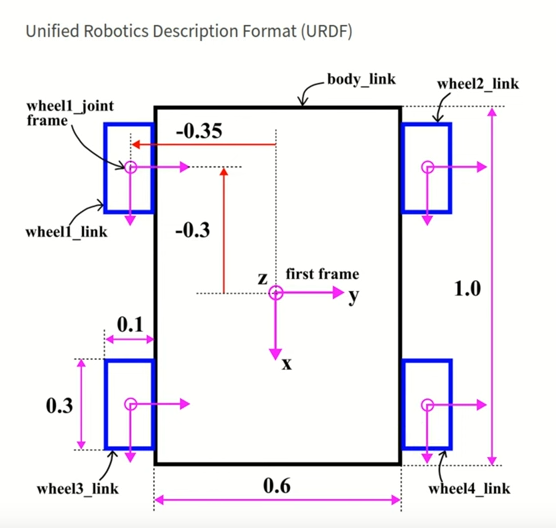

Sure, here's a README.md template for your GitHub repository for the ROS-based four-wheeled robot project:

---

# ROS Four-Wheeled Robot Project

Welcome to the ROS Four-Wheeled Robot Project repository! 🤖✨

## Overview

This project showcases the design and implementation of a four-wheeled robot using ROS (Robot Operating System), Gazebo, and RViz. The robot is equipped with advanced features such as LiDAR and camera plugins, as well as 4-wheel skid drive plugins for optimal maneuverability.

## Features

- **LiDAR Plugin**: Utilizes LiDAR technology for precise environmental mapping and navigation.
- **Camera Plugin**: Incorporates a camera plugin for high-resolution visual perception.
- **4-Wheel Skid Drive Plugins**: Enables optimal control and maneuverability with the use of 4-wheel skid drive plugins.
- **ROS Integration**: Seamless integration with ROS for robust robot control and communication.

## Usage

1. Clone the repository to your local machine:

```bash
git clone https://github.com/yousefh112/four_wheeled_robot_URDF.git
```

2. Launch the ROS nodes:

```bash
roslaunch gazebo_pkg launch.launch
```

3. Visualize the robot in Gazebo:

```bash
roslaunch gazebo_pkg launch.launch
```

4. View robot data in RViz:

```bash
roslaunch gazebo_pkg launch.launch
```

## Design Sketch

